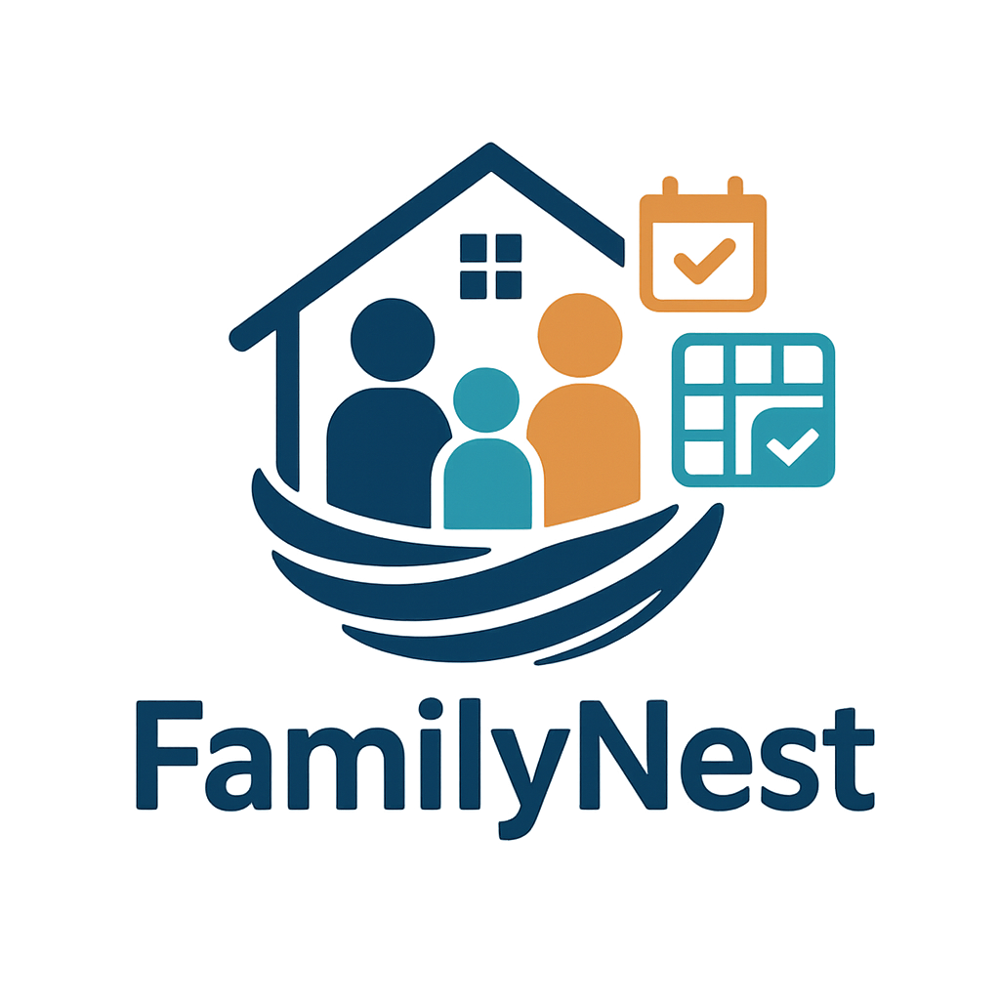

# FamilyNest

**Управляй семейными делами в одном месте. Делитесь моментами, планируйте события и укрепляйте связи.**

Платформа для управления семейной жизнью и коммуникации, построенная на модульной архитектуре, которая поддерживает масштабируемую разработку. Она объединяет управление данными, доменную логику и бизнес-правила для удобной организации семейных задач.



## Оглавление

- [О проекте](#о-проекте)
- [Ключевые особенности](#ключевые-особенности)
- [Начало работы](#начало-работы)
  - [Предварительные требования](#предварительные-требования)
  - [Установка](#установка)
  - [Использование](#использование)
- [Тестирование](#тестирование)

## О проекте

**Почему FamilyNest?**

Этот проект упрощает создание семейно-ориентированных приложений, предоставляя надежную основу для управления данными, интеграции API и организации системы.

## Ключевые особенности

- **Модульная Архитектура**: Обеспечивает масштабируемую и структурированную разработку с четким разделением модулей.
- **Модуль Данных**: Определяет основные сущности, такие как семьи, профили, календари и задачи, для единообразной работы с данными.
- **Интеграция с БД**: Надежно работает с PostgreSQL для устойчивого хранения данных.
- **REST API Endpoints**: Предоставляет удобные API для управления семьей, календарем и уведомлениями.
- **Четкое Разделение Ответственности**: Гарантирует сопровождаемость и масштабируемость на всех уровнях приложения.

## Начало работы

### Предварительные требования

Для работы с проектом необходимы:

- **Язык программирования**: Kotlin
- **Пакетный менеджер**: NuGet (для .NET-компонентов, если применимо) *// Примечание: требует уточнения, так как Kotlin обычно использует Gradle/Maven*

### Установка

Чтобы собрать проект из исходного кода:

1. **Клонируйте репозиторий:**
   ```bash
   git clone https://github.com/your-username/familynest.git
   ```

2. **Перейдите в директорию проекта:**
   ```bash
   cd familynest
   ```

3. **Установите зависимости:**
   ```bash
   ./gradlew build # Или используйте соответствующую команду для вашей системы сборки
   ```

### Использование

Запустите проект с помощью команды:
```bash
./gradlew bootRun # Пример для Spring Boot приложения
```

## Тестирование

В проекте используется фреймворк **JUnit** для тестирования. Чтобы запустить тесты, выполните:

```bash
./gradlew test
```
